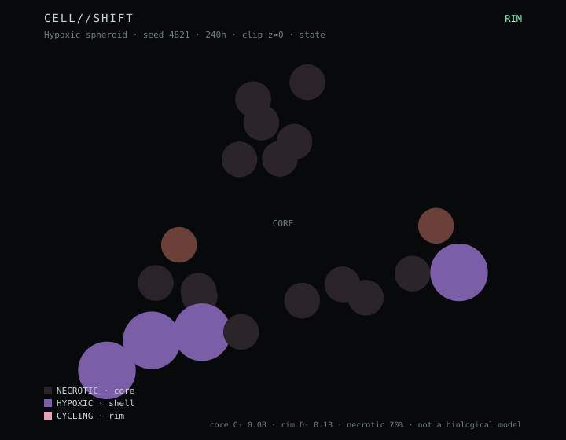

# CELL//SHIFT

[](https://github.com/taipei49314/cell-shift/actions/workflows/ci.yml)

Change the rules a cell lives by. Run the chamber. Watch a tumor-like mass form
from geometry, not from a story.

```
change cell rules → execute simulation → inspect the structure
```

Open the site. The center is a 3D tissue chamber. Color by clone, state,
oxygen, or lineage. Drag the clip plane to open the mass. Click a cell to
read its state, clone, and mutations. **Trace lineage** lights only its
ancestors and descendants.



The figure is regenerated by `npm run figure`. It is chamber geometry, not histopathology.

This is not a biological model. See [CLAIMS.md](CLAIMS.md).
Personal research questions and locked protocols: [RESEARCH.md](RESEARCH.md).
v1.0 landing contract: [LANDING.md](LANDING.md).
Next long task: [T2.md](T2.md) — Failure Atlas.

## Run

```bash
npm install
npm test
npm run dev
```

Windows: double-click `開始艙室.bat`. It starts Vite and opens
`http://127.0.0.1:5173/`. The chamber boots **Living spheroid** (a packed
mass you can see). RESET rebuilds the current hour with the armed SHIFT;
it does not throw you back to 12 founders. Hypoxic / Intact / Invasive
still open at their view hours.

Then open the URL Vite prints (default `http://127.0.0.1:5173`).

Headless (no UI, writes a receipt):

```bash
npm run chamber -- run hypoxic 240
npm run chamber -- campaign adhesion
npm run chamber -- campaign hypoxic-seeds
npm run chamber -- campaign adhesion-seeds
npm run chamber -- campaign invasive-intact
npm run chamber -- campaign oxygen
npm run chamber -- campaign oxygen-seeds
npm run chamber -- campaign motility-seeds
npm run chamber -- campaign shift-seeds
npm run chamber -- ledger
npm run figure
```

## Loop

1. Set **Environment** (oxygen, nutrient, mutation rate) and **Cell rules**
   (cycle time, death, adhesion).
2. **RUN**. The seeded world steps in hours, up to 720 h.
3. Click a cell. Read the inspector. Trace the clone's family.

The seed in the header is the whole experiment. Reset with the same seed and
the same sliders and you get the same tissue.

## What the engine actually does

Each cell is an agent with a parent, a clone id, a 3D position, and a small
trait vector (cycle time, oxygen tolerance, uptake, adhesion, motility).

- Oxygen lives on a 24³ reaction–diffusion grid (boundary supply, cell
  consumption). A packed mass can form a hypoxic / necrotic core. That is a
  measured chamber protocol, not a biological calibration.
- Division copies traits. With the mutation rate, a daughter shifts one trait
  and becomes a new clone (`C1 → C2 → C3`).
- Fitter clones (faster cycle, lower apoptosis, higher hypoxia tolerance)
  take space. That is the only "oncogene" here: a number.

Deterministic PRNG: mulberry32. The timeline stores a frame every 6 h and
seeks by restoring a frame — it does not replay from t = 0. A clone SHIFT is
an overlay on one clone id; it enters the experiment hash and is written in
on RESET.

## Name

Display name is **CELL//SHIFT**. The GitHub repo is `cell-shift` because
`//` is not a legal repository name.

## License

MIT. Simulation, not medicine.
